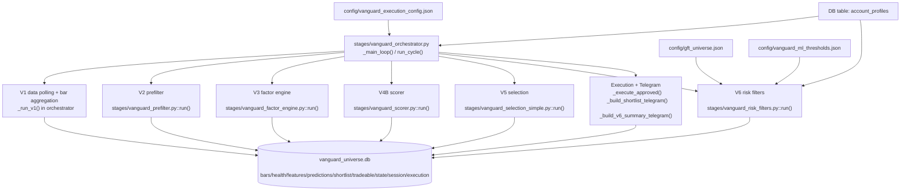

# Vanguard Orchestrator Architecture Map

Last reviewed: 2026-04-04

This document maps the **current Vanguard backend architecture as implemented today**, then describes a **safe path to the target modular architecture** with effort, risk, and benefit tradeoffs.

It is intended to answer:
- How one orchestrator cycle flows through V1 → V6
- Which module owns each decision
- Where profile/account rules are stored
- Which config values come from JSON, DB tables, or hardcoded Python constants
- What it would take to move from the current system to the proposed modular future state

---

## 1. Current System In One Picture

### Current state summary

The backend is **operational but not cleanly modular**:
- The orchestrator is still a **large coordinator plus V1 implementation plus execution/Telegram formatter**.
- Account profile state is split across **`account_profiles` DB rows**, **GFT-specific hardcoded constants in V6**, and **`config/gft_universe.json`**.
- Stage contracts are mostly **DB-mediated**, not explicit in-memory interfaces.
- Some config is **JSON**, some is **DB**, and some is **hardcoded Python constants**.

---

## 2. Orchestrator Runtime Flow

Main file: [/Users/sjani008/SS/Vanguard/stages/vanguard_orchestrator.py](/Users/sjani008/SS/Vanguard/stages/vanguard_orchestrator.py)

### 2.1 Session lifecycle

The orchestrator sends a session-start Telegram, enters `_main_loop()`, runs `run_cycle()` repeatedly, and on shutdown calls `_wind_down()`.

Key implementation points:
- Session start Telegram is emitted in `__init__`/startup flow around lines 700-708.
- `_main_loop()` controls repeated cycles, failure counting, WAL checkpointing, and bar-aligned sleeping at lines 710-758.
- `_wind_down()` stops Alpaca/IBKR adapters, flattens `must_close_eod` accounts, updates `vanguard_session_log`, checkpoints WAL, and sends session-end Telegram at lines 767-813.
- Session gating is **asset-aware** through `is_within_session()` and `_is_polling_asset_enabled()`, not just equity-market hours, at lines 819-829.

### 2.2 One cycle: `run_cycle()`

Entry point: `VanguardOrchestrator.run_cycle()`

Current call sequence:
1. Build a cycle timestamp with `cycle_ts = iso_utc(self._now_utc())`.
2. V1 bar freshness/polling via `self._run_v1()`.
3. V2 prefilter via `stages.vanguard_prefilter.run(dry_run=dry_run, cycle_ts=cycle_ts)`.
4. V3 factor engine via `stages.vanguard_factor_engine.run(survivors=survivors, cycle_ts=cycle_ts, dry_run=dry_run)`.
5. V4B scorer via `stages.vanguard_scorer.run(dry_run=dry_run)`.
6. V5 shortlist selection via `stages.vanguard_selection_simple.run(dry_run=dry_run)`.
7. V6 profile-specific risk filtering via `stages.vanguard_risk_filters.run(dry_run=dry_run, cycle_ts=cycle_ts)`.
8. Build/send Telegram shortlist + GFT V6 summary.
9. If there are approved rows, `_execute_approved()` forward-tracks or submits live orders depending on execution mode.

Code references:
- `run_cycle()` and V1→V6 invocation: lines 865-1037
- `_run_v1()`: lines 1268-1357
- `_execute_approved()`: starts at line 1532
- Shortlist Telegram build: `_build_shortlist_telegram(cycle_ts)` around line 2164

### 2.3 Execution modes

Canonical modes are:
- `manual` → write `FORWARD_TRACKED`, no external orders
- `live` → submit to MetaApi/SignalStack bridges
- `test` → no external orders and no DB/session/execution-log writes

Legacy aliases `off` and `paper` are normalized to `manual` in `_normalize_execution_mode()`.

Execution branch owner:
- `_execute_approved()` in `stages/vanguard_orchestrator.py`

---

## 3. Stage-by-Stage Data Flow

## 3.1 V1 — Data polling, bar aggregation, source health

Implementation owner:
- `VanguardOrchestrator._run_v1()` in [/Users/sjani008/SS/Vanguard/stages/vanguard_orchestrator.py](/Users/sjani008/SS/Vanguard/stages/vanguard_orchestrator.py)

What it does:
- Refreshes universe membership on scheduled refresh times.
- Initializes IBKR / Alpaca / Twelve Data adapters.
- Polls IBKR 1m bars for forex and, during equity/index session, equity.
- Uses Alpaca REST for equities only if IBKR equity bars are unavailable.
- Uses Twelve Data for crypto always, and for forex only as fallback when IBKR forex writes zero bars.
- Aggregates 1m → 5m and 5m → 1h bars.
- Updates per-source health in `vanguard_source_health`.

Main writes:
- `vanguard_bars_1m`
- `vanguard_bars_5m`
- `vanguard_bars_1h`
- `vanguard_source_health`

Config/routing sources:
- Asset session windows are hardcoded in `_ASSET_SESSION_WINDOWS` in `vanguard_orchestrator.py`.
- Execution bridge config comes from `config/vanguard_execution_config.json`.
- Universe membership comes from `vanguard/helpers/universe_builder.py` and its source configs, not from one central runtime config.

Code references:
- `_init_stage1_adapters()`: lines 1071-1169
- `_poll_ibkr_1m()`: lines 1228-1266
- `_run_v1()`: lines 1268-1357
- `_aggregate_recent_1m_to_5m()`: lines 1359-1408
- `_aggregate_recent_5m_to_1h()`: lines 1410-1428
- `_update_source_health()`: lines 1430-1526

## 3.2 V2 — Prefilter / survivor selection

Implementation owner:
- [/Users/sjani008/SS/Vanguard/stages/vanguard_prefilter.py](/Users/sjani008/SS/Vanguard/stages/vanguard_prefilter.py)

Entry function:
- `run(...)` at lines 455-549

What it does:
- Loads active universe members from DB.
- Reads latest 5m and 1m bars per symbol.
- Applies health/session/liquidity/warmup checks in `check_symbol()`.
- Marks each symbol as `ACTIVE`, `STALE`, `WARM_UP`, etc.
- Writes health rows for the cycle unless `dry_run=True`.

Main reads:
- `vanguard_universe_members`
- `vanguard_bars_5m`
- `vanguard_bars_1m`

Main writes:
- `vanguard_health`

Config source:
- `get_thresholds(universe_name)` from the prefilter config path, not a central runtime config.

Important session rule:
- A symbol is marked `STALE` if no bar exists after that asset’s session start, via `session_start_utc(...)` and the session-bar check at lines 435-446.

## 3.3 V3 — Factor computation

Implementation owner:
- [/Users/sjani008/SS/Vanguard/stages/vanguard_factor_engine.py](/Users/sjani008/SS/Vanguard/stages/vanguard_factor_engine.py)

Entry function:
- `run(...)` at lines 314-439

What it does:
- Takes V2 survivors or explicit symbols.
- Groups targets by asset class.
- Loads benchmark bars per asset class.
- Computes a shared feature vector per symbol using `compute_features(...)`.
- Writes both JSON feature blobs and a wide feature matrix.

Main reads:
- `vanguard_health` if `survivors=None`
- `vanguard_bars_5m`
- `vanguard_bars_1h`

Main writes:
- `vanguard_features`
- `vanguard_factor_matrix`

Feature source:
- `FEATURE_NAMES` comes from `vanguard/features/feature_computer.py` and factor modules under `vanguard/factors/`.

## 3.4 V4B — Model scoring

Implementation owner:
- [/Users/sjani008/SS/Vanguard/stages/vanguard_scorer.py](/Users/sjani008/SS/Vanguard/stages/vanguard_scorer.py)

Entry function:
- `run(...)` at lines 297-340

What it does:
- Loads the latest `vanguard_factor_matrix` cycle.
- For each asset class in `MODEL_SPECS`, loads model artifacts and feature metadata.
- Applies cross-sectional standardization to each feature column.
- Predicts `predicted_return`.
- Sets `direction` by sign:
  - `predicted_return > 0` → `LONG`
  - `predicted_return < 0` → `SHORT`
  - `predicted_return == 0` → `FLAT`
- Writes predictions to `vanguard_predictions`.

Main reads:
- `vanguard_factor_matrix`
- model artifacts under `models/`

Main writes:
- `vanguard_predictions`

Config source:
- `MODEL_SPECS` is hardcoded in `stages/vanguard_scorer.py` lines 76-132.

Important current crypto detail:
- `crypto` uses `stacked_crypto_calibrated_v1.pkl`
- `_predict_stacked_crypto_model()` multiplies the meta prediction by the artifact `scale_factor`
- Non-crypto model logic is unchanged

## 3.5 V5 — Shortlist ranking

Implementation owner:
- [/Users/sjani008/SS/Vanguard/stages/vanguard_selection_simple.py](/Users/sjani008/SS/Vanguard/stages/vanguard_selection_simple.py)

Entry function:
- `run(...)` at lines 188-214

What it does:
- Reads latest `vanguard_predictions`.
- Recomputes `direction` from `predicted_return`.
- Computes one-sided `edge_score` as percentile rank of `predicted_return` within each cycle:
  - high `edge_score` means high `predicted_return`
  - therefore for LONG, higher `edge_score` is stronger
  - for SHORT, lower `edge_score` is stronger
- Selects up to `top_n` LONG rows by largest `edge_score`.
- Selects up to `top_n` SHORT rows by smallest `predicted_return` (most negative).
- Writes:
  - `vanguard_shortlist_v2`
  - legacy `vanguard_shortlist` mirror consumed by V6/API

Main reads:
- `vanguard_predictions`

Main writes:
- `vanguard_shortlist_v2`
- `vanguard_shortlist`

Code references:
- Edge score + side assignment: lines 110-125
- DB writes: lines 137-185

## 3.6 V6 — Account-specific approval/rejection + sizing

Implementation owner:
- [/Users/sjani008/SS/Vanguard/stages/vanguard_risk_filters.py](/Users/sjani008/SS/Vanguard/stages/vanguard_risk_filters.py)

Entry functions:
- `run(...)` at lines 1058+
- `process_account(...)` at lines 598-980

What it does:
- Loads all active account profiles from `account_profiles`.
- Loads latest `vanguard_shortlist`.
- Deduplicates shortlist by `(symbol, direction)` and processes the same candidate list separately for each account.
- Applies account/instrument/time/readiness/risk/diversification gates.
- Writes a row per candidate per account with `APPROVED`, `REJECTED`, or `FORWARD_TRACKED`.
- Updates `vanguard_portfolio_state`.

Main reads:
- `account_profiles`
- `vanguard_shortlist`
- `vanguard_bars_5m`
- `vanguard_portfolio_state`

Main writes:
- `vanguard_tradeable_portfolio`
- `vanguard_portfolio_state`

---

## 4. Account/Profile Rules: Where They Live And Who Enforces Them

## 4.1 Source of account profiles

Account profile rows are stored in the DB table `account_profiles`.

CRUD/seed code:
- [/Users/sjani008/SS/Vanguard/vanguard/api/accounts.py](/Users/sjani008/SS/Vanguard/vanguard/api/accounts.py)

Table shape and profile fields:
- `id`, `name`, `prop_firm`, `account_type`, `account_size`, `daily_loss_limit`, `max_drawdown`, `max_positions`, `must_close_eod`, `is_active`
- plus migrated columns: `max_single_position_pct`, `max_batch_exposure_pct`, `dll_headroom_pct`, `dd_headroom_pct`, `max_per_sector`, `block_duplicate_symbols`, `environment`, `instrument_scope`, `holding_style`, `webhook_url`, `webhook_api_key`, `execution_bridge`

Profile loading into V6:
- `load_accounts()` in `stages/vanguard_risk_filters.py` lines 426-445

Profile loading into orchestrator:
- `_load_accounts()` in `stages/vanguard_orchestrator.py` lines 222-232

## 4.2 GFT-specific overrides are not in the profile DB

For `gft_5k`, `gft_10k`, and any account id starting with `gft_`, V6 applies **hardcoded overrides** in Python:
- `GFT_MAX_POSITIONS = 3`
- `GFT_RISK_PER_TRADE_PCT = 0.005`
- `GFT_DAILY_LOSS_LIMIT_PCT = 0.04`
- `GFT_MAX_PORTFOLIO_HEAT_PCT = 0.02`
- GFT forex/crypto sizing floors and stop/take-profit minimums

Code references:
- Constants: `vanguard_risk_filters.py` lines 130-138
- Override mapper: `_gft_risk_params()` lines 161-170
- Contract sizing helpers: `_crypto_contract_size()`, `calculate_forex_lots()`, `calculate_crypto_qty()`, `_size_gft_trade()` lines 141-324

This means the current source of truth for a GFT profile is **DB profile row + hardcoded Python overrides + `gft_universe.json`**, not one config object.

## 4.3 GFT universe allowlist

Allowlist file:
- [/Users/sjani008/SS/Vanguard/config/gft_universe.json](/Users/sjani008/SS/Vanguard/config/gft_universe.json)

Loader/enforcement:
- `_load_gft_universe()` in `vanguard_risk_filters.py` lines 115-125
- normalized set cached as module constant `GFT_UNIVERSE` at line 128
- per-symbol enforcement in `process_account()` lines 725-731

Reject reason emitted:
- `NOT_IN_GFT_UNIVERSE:<symbol>`

Important behavior:
- Internal symbols may be slash-form (`BTC/USD`) or broker-like suffix-form (`BTCUSD.x`), but `_normalize_gft_symbol()` strips `/`, `.CASH`, `.X` before comparison.

---

## 5. Rule-By-Rule Approval/Reject Map In V6

This is the exact order of major gates inside `process_account()` for one account and one cycle.

| Gate | What it checks | Who drives the config/state | Reject/status emitted | Code location |
|------|----------------|-----------------------------|-----------------------|---------------|
| Account status gate | Account must be `ACTIVE` from portfolio state + profile limits | `vanguard_portfolio_state` + `account_profiles` via `get_account_status()` | skips all trades; updates account state | `process_account()` lines 636-643 |
| EOD / no-new-trades gate | `must_close_eod`, `no_new_positions_after`, `eod_flatten_time` | profile DB row + `check_eod_action()` | returns no rows on `FLATTEN_ALL`; `NO_NEW_TRADES_AFTER_CUTOFF` for non-GFT-crypto rows | lines 645-657 and 776-780 |
| Instrument scope filter | Account can only trade its configured asset scope; GFT universe is treated as `all_assets` then allowlisted | `account_profiles.instrument_scope` + `gft_universe.json` | `NOT_IN_GFT_UNIVERSE:<symbol>` | lines 614-617, 668-676, 725-731 |
| Readiness/model gate | `model_readiness` must be `live_native` or `live_fallback`; `validated_shadow` becomes forward-tracked; score must be `> 0.0` | candidate row fields from V5/V4B | `FORWARD_TRACKED` or `REJECTED` with `readiness=..., edge_score=...` | `_apply_readiness_gate()` lines 545-579 and usage lines 733-774 |
| Position count gate | Caps number of approved rows for this account in the current cycle | GFT hardcoded `max_positions=3`; non-GFT from `account_profiles.max_positions` but effectively relaxed to at least `len(eligible)` | `POSITION_LIMIT` | lines 678-685 and 782-787 |
| TTP consistency rule | Optional TTP “best trade vs total valid PnL” concentration check | `account_profiles.consistency_rule_pct` + `vanguard_portfolio_state` | `CONSISTENCY_RULE` | lines 789-800 |
| Price/ATR availability | Latest 5m close must exist; ATR must be positive | `vanguard_bars_5m` + `compute_atr()` | `NO_ATR_DATA`; if price query fails, code currently falls back to `entry_price=100.0` instead of rejecting | lines 802-819 |
| Risk budget gate | Remaining daily/drawdown budget must support nonzero position risk | profile DB row and GFT hardcoded risk override | `NO_RISK_BUDGET` | lines 821-835 |
| Sizing gate | Shares/lots must be > 0 after ATR-based sizing | GFT sizing helpers or `size_equity()` | `SIZING_ZERO_SHARES` | lines 837-866 |
| GFT absolute risk caps | Computed `actual_risk` and requested `risk_dollars` must not exceed GFT cap | hardcoded GFT risk pct + account size | `GFT_MISSING_STOP_PRICE`, `GFT_ACTUAL_RISK_CAP:...`, `GFT_RISK_CAP:...` | lines 868-903 |
| Min trade range | For TTP, TP-entry range must exceed configured cents threshold | `account_profiles.min_trade_range_cents` | `MIN_TRADE_RANGE` | lines 905-911 |
| Sector cap | Approved symbols per sector must stay under cap | `account_profiles.max_per_sector`; current code effectively relaxes this to at least `len(eligible)` | `SECTOR_CAP:<sector>` | lines 913-920 |
| Correlation cap | New symbol should not be too correlated with already approved symbols | `account_profiles.max_correlation`; current code effectively relaxes floor to `>= 1.0` | `CORRELATION:<symbol>` | lines 922-928 |
| Portfolio heat cap | Sum of `risk_dollars/account_size` must stay under max heat | GFT hardcoded `0.02`; non-GFT from profile but effectively relaxed to at least `1.0` | `HEAT_CAP` | lines 930-937 |

## 5.1 Why ETH and BNB are rejected as `POSITION_LIMIT` in your GFT Telegram

For GFT accounts, `max_positions` is hardcoded to `3` in `_gft_risk_params()`.

In each cycle, once three candidates have already been appended with `status == "APPROVED"`, later GFT candidates are rejected here:
- `if open_positions + len([r for r in results if r["status"] == "APPROVED"]) >= max_positions: ... POSITION_LIMIT`

Current implementation detail:
- `open_positions` is set to `0` every cycle in V6 test/live processing logic.
- That means `POSITION_LIMIT` is currently enforcing **“max 3 approvals from this cycle shortlist”**, not true carried portfolio positions from prior cycles.

That explains your current message:
- BTC, LTC, SOL approved first for `gft_10k`
- ETH and BNB rejected afterward as `POSITION_LIMIT`

## 5.2 What does **not** currently drive GFT approval

GFT approval is **not** directly governed by a single JSON profile.

Specifically:
- `config/gft_universe.json` controls only the **symbol allowlist**
- `account_profiles` controls only the profile row fields currently read from DB
- hardcoded GFT overrides in `vanguard_risk_filters.py` override several DB knobs
- Telegram only displays the resulting `status` and `rejection_reason`; it does not make the risk decision

---

## 6. Config Source Map

| Value / Concern | Current source | Consumed by | Notes |
|-----------------|----------------|-------------|-------|
| Active account profiles and most profile fields | `account_profiles` DB table | Orchestrator, V6, Unified API | Seeded/migrated by `vanguard/api/accounts.py` |
| GFT symbol allowlist | `config/gft_universe.json` | V6, GFT Telegram formatter | Cached at import time in V6 module constant `GFT_UNIVERSE` |
| GFT max positions / risk pct / heat caps / min SL/TP floors | hardcoded constants in `stages/vanguard_risk_filters.py` | V6 | Overrides DB profile values for `gft_*` accounts |
| Readiness/ML thresholds config path | `config/vanguard_ml_thresholds.json` | V6 helper `_ml_threshold()` | Current `_apply_readiness_gate()` no longer uses the threshold value; it only checks `edge_score > 0.0` |
| V1 source routing by asset session | hardcoded `_ASSET_SESSION_WINDOWS` + adapter init logic in orchestrator | V1 polling | Not centralized into one runtime config |
| Execution credentials and bridge config | `config/vanguard_execution_config.json` + env vars | Orchestrator / MetaApi / SignalStack | `_load_exec_config()` resolves `ENV:` values |
| Model file selection and feature lists by asset class | hardcoded `MODEL_SPECS` in `stages/vanguard_scorer.py` | V4B scorer, trainer alignment | Not centralized |
| Universe materialization rules | `vanguard/helpers/universe_builder.py` and its config inputs | V1 universe refresh, V2 symbol universe | Separate from GFT allowlist |
| Telegram formatting and streak display | hardcoded in `stages/vanguard_orchestrator.py` | Telegram output only | Not a decision gate |

---

## 7. Storage / State Map

All main runtime state lives in `data/vanguard_universe.db`.

| Table | Producer | Consumer | Purpose |
|-------|----------|----------|---------|
| `vanguard_universe_members` | Universe builder / V1 boot refresh | V1, V2 | Canonical active symbol universe |
| `vanguard_bars_1m` | IBKR/Alpaca/Twelve Data adapters | V1 aggregation, V2 | Raw intraday bars |
| `vanguard_bars_5m` | V1 aggregation | V2, V3, V6 price lookup, API price enrichment | 5m bars |
| `vanguard_bars_1h` | V1 aggregation | V3 | 1h bars |
| `vanguard_source_health` | V1 `_update_source_health()` | Unified API `/api/v1/system/status`, `/api/v1/data/health` | Source freshness by source + asset class |
| `vanguard_health` | V2 prefilter | V3 | Symbol health / ACTIVE survivors |
| `vanguard_features` | V3 factor engine | Validation / historical inspection | JSON feature blobs |
| `vanguard_factor_matrix` | V3 factor engine | V4B scorer | Wide feature matrix |
| `vanguard_predictions` | V4B scorer | V5 selection | Predicted returns and side |
| `vanguard_shortlist_v2` | V5 selection | Orchestrator Telegram | Current simple shortlist |
| `vanguard_shortlist` | V5 selection legacy mirror | V6, Unified API Vanguard adapter | Legacy-compatible shortlist |
| `vanguard_tradeable_portfolio` | V6 risk filters | Orchestrator execution + GFT Telegram | Per-account approval/reject rows |
| `vanguard_portfolio_state` | V6 and helper module | V6, Unified API portfolio endpoint | Per-account daily state |
| `vanguard_session_log` | Orchestrator | Unified API system-status endpoint | Session start/end counters |
| `execution_log` | Orchestrator / trade desk | Unified API portfolio + execution endpoints | Submitted / forward-tracked trade rows |
| `account_profiles` | Unified API account module | Orchestrator, V6 | Active account/profile config |

---

## 8. Current Architecture Pain Points

These are the concrete issues that make the current system harder to reason about than it should be.

1. **Split config authority**
   - Profile rules live in DB rows.
   - GFT allowlists live in JSON.
   - GFT risk knobs and V1 session windows are hardcoded in Python.
   - Model specs and feature lists are hardcoded in the scorer.

2. **Fat orchestrator**
   - `vanguard_orchestrator.py` owns session lifecycle, adapter bootstrapping, V1 polling, stage dispatch, execution, Telegram formatting, loop locking, WAL maintenance, and operator logs.
   - This makes “where does this behavior live?” harder than necessary.

3. **V6 mixes account policy, risk sizing, DB loading, and row writing**
   - `process_account()` is doing eligibility, profile override logic, ATR sizing, risk caps, diversification, and status-row construction in one pass.

4. **Implicit DB contracts between stages**
   - Stages communicate mostly through tables and “latest cycle” lookups instead of explicit interfaces.
   - This works, but it makes schema drift and timestamp mismatches harder to debug.

5. **Some risk gates are effectively disabled/relaxed by current implementation**
   - Non-GFT `max_positions`, sector cap, correlation cap, and heat cap are currently relaxed by `max(..., len(eligible))`, `max(..., 1.0)`, etc.
   - That may be intentional for testing, but it means code comments and actual behavior are not fully aligned.

---

## 9. Target Future Architecture

This is the target architecture you described, expressed in implementation terms.

| Layer | Responsibility | Target location |
|-------|----------------|-----------------|
| Config | One source of truth for settings, universes, account rules, model-feature bindings | `config/vanguard_config.yaml` or `config/vanguard_runtime.json` plus loader module |
| Data Adapters | IBKR / Alpaca / Twelve Data polling and fallback logic | `vanguard/data_adapters/` + `vanguard/data_adapters/router.py` |
| Pipeline | Explicit V1→V2→V3→V4→V5→V6 chain with one cycle context | `stages/pipeline.py` |
| Account Manager | Per-profile rules, execution bridge selection, account-specific policy | `vanguard/accounts/` |
| Features / Scoring | Feature generation and model inference modules | `vanguard/features/`, `vanguard/scoring/` |
| Risk & Filters | Position sizing, caps, EOD rules, allowlists, reject reasons | `vanguard/risk/` |
| Orchestrator | Thin loop/session shell and notifications only | slim `stages/vanguard_orchestrator.py` |

## 9.1 What “one clear home” should mean

For any future engineer reading the code:
- “Which symbols can GFT trade?” → one config section + one account-policy module
- “Why was ETH rejected?” → one risk policy module and one reject reason map
- “Which source should crypto/forex/equity poll right now?” → one data router module
- “Which model + features score crypto?” → one scorer config section + one scoring module
- “What does the orchestrator do?” → only loop/session/timing + call pipeline + send notifications

---

## 10. How To Get From Current State To Future State

I would **not** do a big-bang rewrite. The safer path is a 4-phase extraction where each phase preserves current DB tables and existing stage outputs.

### Phase 1 — Centralize config authority

Goal:
- Introduce one runtime config object as the canonical source for static knobs.

What to move first:
- GFT allowlist
- GFT max positions / risk pct / heat caps / stop floors
- Asset-session windows
- V1 source routing preferences
- V5 shortlist display limits
- Execution mode defaults / Telegram formatting limits

What to keep unchanged in this phase:
- Existing V1→V6 stage functions
- Existing DB tables
- Current account profile CRUD endpoints, initially as a DB mirror if needed

Estimated effort:
- **2-4 engineering days** if done carefully with compatibility fallback

Main risk:
- Accidentally creating two competing config sources instead of one authoritative loader
- Breaking startup if config defaults are incomplete

Benefit:
- Removes the biggest current source of confusion: “is this rule in DB, JSON, or Python?”

### Phase 2 — Extract Account Manager + Risk policy

Goal:
- Move per-account policy and reject rules out of the monolithic V6 function.

Target shape:
- `vanguard/accounts/gft.py`, `vanguard/accounts/ftmo.py`, `vanguard/accounts/ttp.py`
- `vanguard/risk/sizing.py`, `vanguard/risk/gates.py`, `vanguard/risk/eod.py`

Keep the same table outputs:
- `vanguard_tradeable_portfolio`
- `vanguard_portfolio_state`

Estimated effort:
- **4-7 engineering days**

Main risk:
- Silent behavior drift in reject reasons or position sizing
- Mis-ordering gates and changing approvals without noticing

Benefit:
- Reject logic becomes inspectable and testable per profile
- Adding a new prop firm becomes a targeted module addition instead of editing one huge function

### Phase 3 — Extract Data Router and explicit pipeline coordinator

Goal:
- Remove source-routing and stage dispatch complexity from the orchestrator.

Target shape:
- `vanguard/data_adapters/router.py` decides active source set by asset class + current session + CLI force override
- `stages/pipeline.py` owns V1→V6 sequencing and one `cycle_ts`
- Orchestrator only owns loop/session lifecycle, lock/WAL, and notifications

Estimated effort:
- **3-5 engineering days**

Main risk:
- Reintroducing timing bugs or duplicate polling if the router does not exactly match current fallback semantics

Benefit:
- Easier to reason about “why did Twelve Data poll?” and “why is forex closed/open?”
- Lower risk of one orchestrator edit breaking unrelated execution or Telegram behavior

### Phase 4 — Test harness + contract docs + UI/backend schema cleanup

Goal:
- Make stage interfaces and API payloads explicit and regression-tested.

What to add:
- Unit tests for each risk reject reason and sizing path
- Golden tests for stage outputs on a known DB snapshot
- API contract tests for `/api/v1/candidates`, `/api/v1/system/status`, `/api/v1/portfolio/state`
- Docs describing the final runtime config schema and module boundaries

Estimated effort:
- **3-6 engineering days**

Main risk:
- Test fixtures becoming stale if DB schema evolves without updating fixtures

Benefit:
- Much safer future model/config changes
- Faster debugging when Telegram/API output looks wrong

## 10.1 Total effort and pain estimate

If done as a careful phased refactor while keeping the system running:
- **Total effort: 12-22 engineering days**
- **Pain level: 7/10**

If done as a rushed one-shot rewrite:
- **Pain level: 9/10**
- Higher chance of breaking live loop behavior, GFT profile rules, or DB contracts

## 10.2 Biggest risks

1. **Silent policy drift in V6**
   - Same candidate, same account, different approval outcome after refactor.
   - This is the main risk and needs before/after comparison tests.

2. **Config precedence ambiguity**
   - If DB profile rows and a new runtime JSON both remain writable, operators may not know which one wins.
   - This must be solved explicitly in Phase 1.

3. **Stage contract drift**
   - If a table schema or `cycle_ts` contract changes without updating all stages/API adapters, UI and Telegram become inconsistent again.

4. **Router fallback regressions**
   - Forex/crypto/equity source selection must preserve the exact desired market-session behavior.

## 10.3 Biggest advantages

1. **Faster debugging**
   - Rule ownership and config source become obvious.

2. **Safer account-specific changes**
   - GFT/FTMO/TTP policy edits become isolated instead of touching one shared monolith.

3. **Cleaner UI integration**
   - API payloads and field registries can be treated as intentional contracts instead of adapter side effects.

4. **Lower runtime surprise**
   - A thin orchestrator plus explicit router/pipeline reduces accidental duplicate polling, stale-state confusion, and hidden fallback behavior.

5. **Easier future expansion**
   - New prop firms, new asset classes, or new model families can be added by editing dedicated modules/config instead of chasing rules across multiple files.

---

## 11. Practical Recommendation

For tomorrow, the safest next step is:
1. **Phase 1 config consolidation only**, with the current stage code left mostly intact.
2. Make one config loader authoritative for GFT allowlist, GFT risk knobs, asset sessions, and source routing.
3. Keep existing DB tables and V1→V6 call order unchanged.
4. Add one “config source map” section in logs/startup so it is obvious which values were loaded from config vs DB.
5. Only after parity is verified for a few manual cycles, start extracting Account Manager / Risk modules.

That gets you closer to the future architecture **without gambling the currently working loop**.
